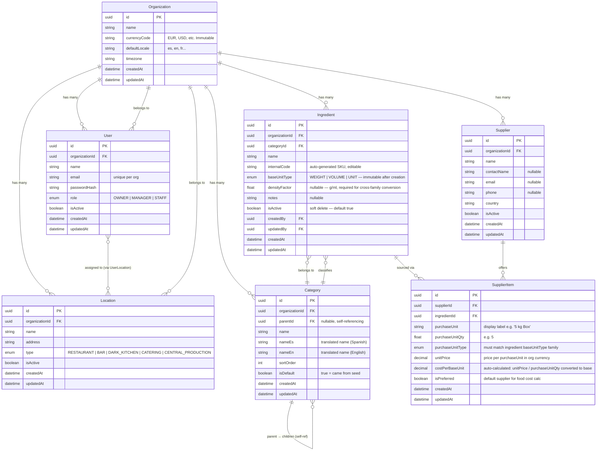
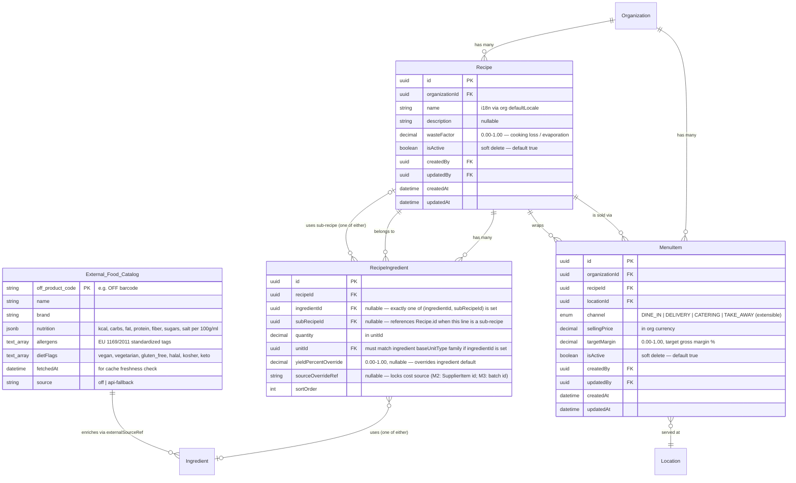

# Data Model — Entity Relationship Diagram (ERD)

**Project:** openTrattOS  
**Scope:** Module 1 (Foundation) + Shared Entities  
**Date:** 2026-04-19

---

## 1. Entity Relationship Diagram

---

## 2. Key Design Rules

### 2.1 Soft Delete
- Entities with `isActive` field are **never physically deleted**.
- Deactivated records:
  - Disappear from all default list views (filtered by `isActive = true`)
  - Remain visible in historical recipes and reports that reference them (shown greyed out with a "discontinued" badge)
  - Can be reactivated by an `OWNER` or `MANAGER`

### 2.2 Audit Fields
Every primary entity includes:
- `createdAt` (auto-set on insert)
- `updatedAt` (auto-set on every update)
- `createdBy` / `updatedBy` (FK → User, set by auth middleware)

This provides a basic **audit trail** for compliance. A full audit log table 
(storing field-level diffs) is reserved for Module 3 (HACCP) where regulatory 
traceability demands it.

### 2.3 Cascade & Referential Integrity

| Parent | Child | On Delete |
|---|---|---|
| Organization | Location, User, Ingredient, Supplier, Category | `CASCADE` (delete org = delete everything) |
| Category | Ingredient | `RESTRICT` (cannot delete a category that has ingredients) |
| Category | Category (children) | `RESTRICT` (cannot delete a parent with children) |
| Supplier | SupplierItem | `CASCADE` (delete supplier = delete its items) |
| Ingredient | SupplierItem | `CASCADE` (delete ingredient = delete its supplier links) |

### 2.4 Currency
- Currency is set at `Organization` level (`currencyCode` field, ISO 4217).
- **All monetary values** (`unitPrice`, `costPerBaseUnit`) are stored and displayed in the organization's currency.
- Multi-currency support (e.g. a supplier billing in USD to a EUR organization) is **out of scope for V1**. Reserved for future enhancement.

---

# Module 2 Extensions (added 2026-04-27 post-Gate-A approval of [PRD-2](./prd-module-2-recipes.md))

## 3. M2 Entity Relationship Diagram (additions)

## 4. Ingredient extensions (M2 retrofit on M1's Ingredient table)

| Column | Type | Default | Purpose |
|---|---|---|---|
| `nutrition` | `jsonb` | `null` | macros per 100g/ml: `{kcal, carbs, fat, protein, fiber, sugars, salt}` (from OFF or manual) |
| `allergens` | `text[]` | `'{}'::text[]` | EU 1169/2011 standardized tags (from OFF or manual override) |
| `dietFlags` | `text[]` | `'{}'::text[]` | `vegan`, `vegetarian`, `gluten_free`, `halal`, `kosher`, `keto`, etc. |
| `brandName` | `varchar(120)` | `null` | separate from `name` (e.g. `name="Tomate triturado"`, `brandName="Heinz"`) |
| `externalSourceRef` | `varchar(64)` | `null` | OFF product code or barcode pointing to `external_food_catalog` |
| `yieldPercentDefault` | `decimal(4,3)` | `1.000` | default trim/yield factor (chef can override per RecipeIngredient line) |

All columns are additive (nullable / default-empty); migrations are non-breaking.

## 5. User retrofit (M2 prerequisite)

Add to `User` table:

| Column | Type | Default | Purpose |
|---|---|---|---|
| `phoneNumber` | `varchar(20)` | `null` | E.164 format. Future use: WhatsApp routing (M2.x via WA-MCP allowlist). Nullable in M2 MVP. |

## 6. M2 Cascade & Referential Integrity (extends §2.3)

| Parent | Child | On Delete |
|---|---|---|
| Organization | Recipe, MenuItem | `CASCADE` (delete org = delete everything) |
| Recipe | RecipeIngredient | `CASCADE` (delete recipe = delete its ingredient lines) |
| Recipe | MenuItem | `RESTRICT` (cannot delete a Recipe referenced by an active MenuItem; soft-delete first) |
| Ingredient | RecipeIngredient | `RESTRICT` (per ADR-009 soft-delete pattern; deactivated ingredients show greyed in UI) |
| Recipe (sub-recipe) | RecipeIngredient (using it) | `RESTRICT` (prevents orphaning sub-recipe references) |
| Location | MenuItem | `RESTRICT` (cannot delete a Location with active MenuItems; deactivate first) |

## 7. M2 Key design rules

### 7.1 Cost precision (per [ADR-015](./architecture-decisions.md))
- All monetary fields use `numeric(18,4)` internally
- Display rounds to 2 decimals, half-even
- Sub-recipe rollup tolerance ≤0.01% accumulated error (5 levels × 30 ingredients)

### 7.2 Sub-recipe cycle detection (per [ADR-014](./architecture-decisions.md))
- Pre-commit graph walk
- Hard depth cap at 10 levels
- Error names both nodes + direction

### 7.3 Cost source resolution (per [ADR-011](./architecture-decisions.md))
- Stable `InventoryCostResolver` interface
- M2: returns preferred SupplierItem cost (or `sourceOverrideRef` if set on the line)
- M3: returns FIFO oldest-batch cost via the same signature

### 7.4 Allergen aggregation (per [ADR-017](./architecture-decisions.md))
- Conservative: ANY allergen on ANY ingredient bubbles up to Recipe-level
- Never auto-clear; chef can override with attribution + reason (Manager+ role)
- Recipe-level free-text "may contain traces of [allergen]" for cross-contamination

### 7.5 Diet-flag inference (per [ADR-017](./architecture-decisions.md))
- Conservative: a dietFlag is true at Recipe-level only if ALL ingredients carry it
  AND no contradicting allergen is present
- Manager+ role can override with explicit reason

### 7.6 OFF data sync (per [ADR-012](./architecture-decisions.md))
- `external_food_catalog` populated weekly from OFF dump
- API fallback on cache miss or stale (>30d)
- ODbL compliance: usage-OK, no-redistribution

